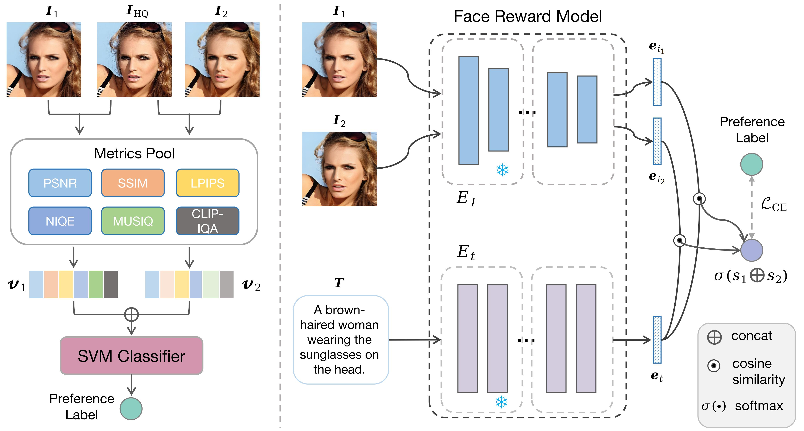
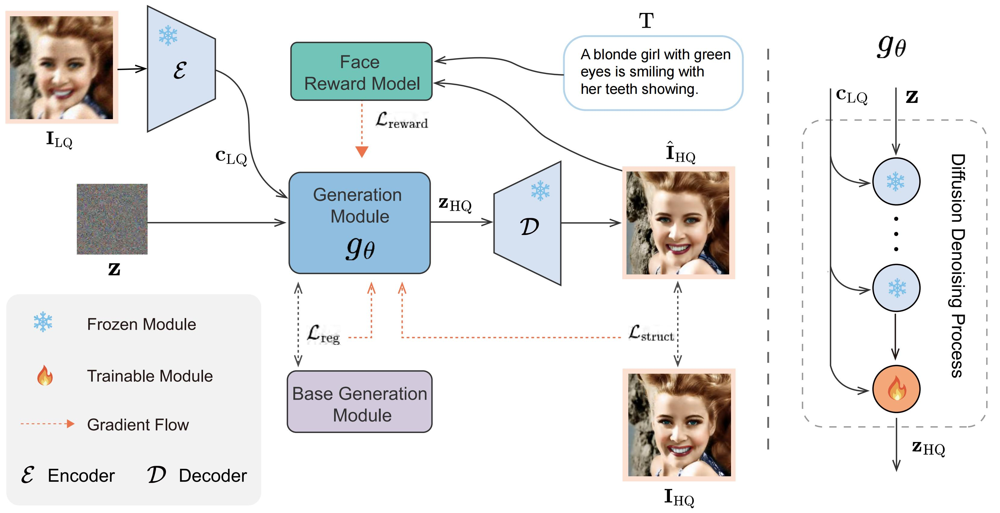
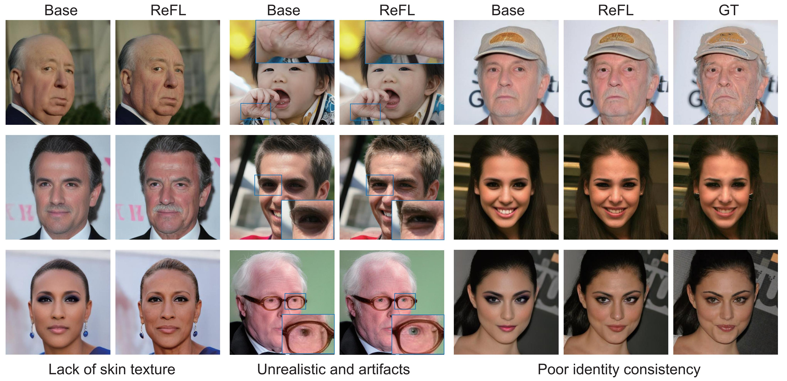

# DiffusionReward: Enhancing Blind Face Restoration through Reward Feedback Learning

<p align="center">
    
</p>

<p align="center">
    <a href="https://arxiv.org/abs/2505.17910">📄 Read our paper on arXiv</a>
</p>

## 📖 Overview

This project introduces the DiffusionReward method, which enhances blind face restoration through reward feedback learning. Using DiffBIR+ReFL as an example, we provide inference and training code.

## 🖼️ Model Architecture and Results

### Model Architecture
Face Reward Model
<p align="center">
    
</p>

DiffusionReward
<p align="center">
    
</p>

### Visual Results
Before and after comparison
<p align="center">
    
</p>

## 🚀 Quick Start

### Environment Setup

1. **Create conda environment**
   ```bash
   conda create -n DiffusionReward python=3.10
   conda activate DiffusionReward
   ```

2. **Install dependencies**
   ```bash
   pip install -r requirements.txt
   ```

## 🔍 Model Validation

### Dataset Preparation

**Test Dataset Download**
- CelebA-Test, LFW-Test, and Webphoto-Test datasets are from the VQFR public repository
- Download link: [VQFR Repository](https://github.com/TencentARC/VQFR)

### Model Weights Download
Download the ControlNet weights for Diffbir+ReFL [here](https://drive.google.com/file/d/1jLZP_NGxKcfhjN8rJXcbtBGXTin4vo3x/view?usp=sharing).  
Place the weight file in the `./weights` folder.


Run the following command to perform model validation:

### 
```bash
CUDA_VISIBLE_DEVICES=0 python inference.py \
    --task face \
    --diffbir_refl_path ./weights/diffbir_refl.pt \
    --version v1_refl \
    --captioner none \
    --pos_prompt '' \
    --neg_prompt "low quality,blurry,low-resolution,noisy,unsharp,weird textures" \
    --cfg_scale 1.0 \
    --sampler ddim \
    --input ./dataset/celebA/celeba_512_validation_lq/ \
    --output ./output/celeba_diffbir/ \
    --device cuda \
    --precision fp32
```

### Parameter Description

- `--task`: Task type, set to `face`
- `--diffbir_refl_path`: Path to DiffBIR+ReFL model weights
- `--version`: Model version
- `--input`: Input image path
- `--output`: Output result save path
- `--sampler`: Sampler type

## 🏋️ Model Training

### Training Dataset Preparation

1. **FFHQ Dataset Preparation**
   - First download the FFHQ dataset: [FFHQ Dataset](https://github.com/NVlabs/ffhq-dataset)
   - **Anonymous Account Provided**: Download our prepared text description files: [Text Description Files](https://drive.google.com/file/d/1rqdeWr_BB50Q-4_1H6AfR8WEf9G31M7_/view?usp=sharing)
   - Extract the text description files to the FFHQ image folder
   - Download the [images_paths.txt](https://drive.google.com/file/d/1lip4_0VdIH9L1cZoHw6IJ3_WrDeAFv3k/view?usp=sharing) file, which contains relative path information for images

2. **Dataset File Structure**
   ```
   dataset/
   └── FFHQ/
       ├── FFHQ_&_caption/
       │   ├── 00000.png
       │   ├── 00000.txt
       │   ├── ...
       │   ├── 69999.png
       │   └── 69999.txt
       └── image_paths.txt
   ```
### Model Weights Download

To run the training phase, download the following pre-trained model weights and place them in the `./weights` folder:

- **Stable Diffusion**: Download the pre-trained weights for the SD-2.1 model [here](https://drive.google.com/file/d/1FFLDPLiHcKA4AQjW6AuVz8RUkkUcLmXs/view?usp=drive_link).  

- **DiffBIR**: Download the pre-trained weights for the DiffBIR-v1 face model [here](https://drive.google.com/file/d/1-8esNaZIVyzM4ttpJg795E4ucpRrvEaC/view?usp=drive_link).  

- **SwinIR**: Download the pre-trained weights for the SwinIR model [here](https://drive.google.com/file/d/11T6OsjATJ5gEbkBGOQHRVR38ltTtm8kb/view?usp=drive_link).  

- **FaceReward**: Download the pre-trained weights for the FaceReward model [here](https://drive.google.com/file/d/1ugATjemF-70b4N1dQrQJ8J1cdmiVeqOR/view?usp=drive_link).  


### Start Training

Use the following command to start training:

```bash
accelerate launch train.py --config configs/train/train_diffbir_refl.yaml
```
**Note**: Please modify the weight paths in the `.yaml` file according to your actual file locations.

## 🙏 Acknowledgments
This work is built upon the excellent foundation provided by the [DiffBIR](https://github.com/XPixelGroup/DiffBIR) repository. We sincerely thank the authors for their outstanding contribution to the field of blind image restoration.

## 🤝 Citation
If you take use of our code or feel our paper is useful for you, please cite our papers:
```bash
@misc{wu2025diffusionrewardenhancingblindface,
      title={DiffusionReward: Enhancing Blind Face Restoration through Reward Feedback Learning}, 
      author={Bin Wu and Wei Wang and Yahui Liu and Zixiang Li and Yao Zhao},
      year={2025},
      eprint={2505.17910},
      archivePrefix={arXiv},
      primaryClass={cs.CV},
      url={https://arxiv.org/abs/2505.17910}, 
}
```